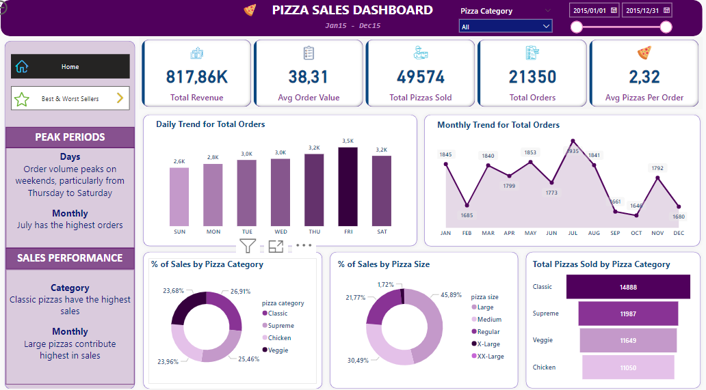
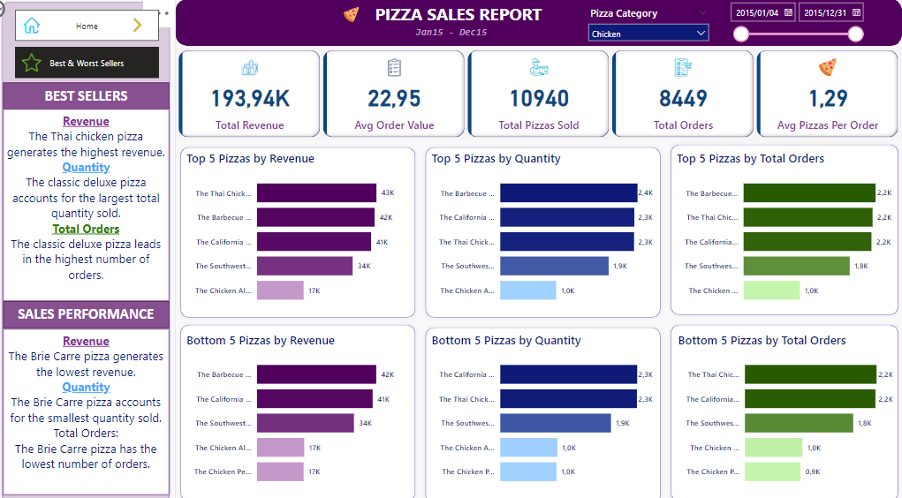

# Pizza Sales Analysis Dashboard

   

Overview
This project demonstrates the creation of an interactive Power BI dashboard to analyze pizza sales data for the year 2015. The project integrates both SQL for data extraction and Power BI for data visualization, enabling key business insights into sales trends, customer preferences, and performance across pizza categories.

Objectives
Analyze pizza sales data to uncover insights and trends.
Calculate key performance indicators (KPIs) such as total revenue, average order value, and total pizzas sold.
Build an interactive dashboard for dynamic data exploration and decision-making.
Tools and Technologies
SQL: Data extraction and preparation.
Power BI: Data visualization and dashboard creation.
Power Query: Data cleaning and transformation.
MS SQL Server: Data storage and management.
Data Preparation
Data Source:
A CSV file containing pizza sales data was imported into MS SQL Server.
SQL Queries:
KPIs: Calculated total revenue, total pizzas sold, total orders, and average order value using SQL queries.
Trends: Extracted daily and monthly order trends using SQL’s DateName function to analyze seasonal patterns.
Data Transformation:
Cleaned data in Power BI’s Power Query Editor, including renaming pizza sizes from abbreviations (e.g., "L" to "Large").
Documented the data transformation steps within Power Query for reproducibility.
Dashboard Features
KPIs:

Displayed total revenue, average order value, total orders, and total pizzas sold using card visuals.
Sales Trends:

Line chart showing monthly sales trends, identifying high and low sales periods.
Column chart visualizing daily orders to pinpoint peak sales days.
Pizza Performance:

Donut charts displaying sales breakdown by pizza category and size.
Funnel chart visualizing the total pizzas sold by category for easy comparison.
Best and Worst Sellers:

Bar charts showing the top five best-selling pizzas by revenue and total orders.
Analysis revealed that while the Thai Chicken pizza generated the highest revenue, the Classic Deluxe sold the most in terms of quantity.
Interactive Filters:

Slicers for pizza category, size, and date range.
Interactive filters allow users to drill down into specific periods and product categories.
Key Insights
Top Performers: The Thai Chicken pizza had the highest revenue, while the Classic Deluxe pizza led in quantity sold.
Underperformers: The Brie Carre pizza was consistently among the lowest sellers across revenue and orders, indicating potential for menu revision.
Seasonal Trends: Sales peaked during certain months, providing insights for seasonal marketing strategies.
How to Use
Open the Power BI dashboard file.
Use the interactive slicers to filter the data by pizza category, size, or time period.
Explore the charts and KPIs to gain insights into sales performance and trends.
